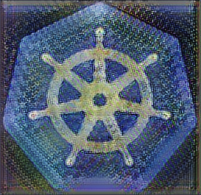

# DockerNN

&nbsp;

<p float="left" align="center" padding="100px">
  
  
</p>

&nbsp;

DockerNN is a very small neural network library built with docker containers. The library models neural network models as sequence of client-server layers instead of the conventional methods. Docker containers are orchestrated using Kubernetes which comes with nice suite of features like load balancing, auto healing and makes distributed computing easier.

## Overview

DockerNN is a neural network library that is very similar to PyTorch. DockerNN provides modules to build and train small models like MLP with automatic forward and backward engines. DockerNN contains two parts, a client and a server. The client part of DockerNN will be used by the client to build and train neural networks. The server part of DockerNN will be running on a Kubernetes Cluster. Training on the client side will typically involve looping through the layers used by the clients. Each layer in the client model will make a request to the cluster for a particular service. The server will then process the request and returns the results back to the client. Kubernetes Cluster can be as simple as a single desktop machine or a more sophisticated machine with mutliple nodes. Kubernetes provides different features like load balancing and much more which makes scalability easier.

&nbsp;

<p float="left" align="center" padding="100px">
  &nbsp;&nbsp;
</p>
&nbsp;

## Requirements

1. numpy
2. blosc
3. flask
4. docker
5. kubernetes
6. kubeadm
7. kubelet

## Building DockerNN

1. Execute the following code in terminal to clone the project.

```bash
$ git clone https://github.com/iVishalr/dockerNN.git
$ cd dockerNN
```

2. Install the required packages

```bash
$ pip install -r requirements.txt
```

3. Building DockerNN images

```bash
$ cd dockernn
$ docker-compose build
```

4. Setting up your local Kubernetes Cluster

```bash
$ chmod +x kubecluster.sh
$ chmod +x kubecluster_teardown.sh
```

Starting Kubernetes Cluster

```bash
$ bash kubecluster.sh
```

`kubecluster.sh` script will guide to help you setup your local kubernetes cluster. Make sure you do not have any other kubernetes cluster emulator like Minikube or Kind installed. This will interfere with different environment variables that kubernetes cluster uses to start the cluster. The script also asks for the IP Address of your local machine. Please use `ip addr show` or `ifconfig` to note down your IP Address.

Stopping Kubernetes Cluster

```bash
$ bash kubecluster_teardown.sh
```

This script will reset your kubernetes cluster and reset the IP tables. The conf file present in `$HOME/.kube/` will also be removed.

You can find a detailed procedure to setup kubernetes cluster below.

## Deploying DockerNN

Once kubernetes cluster is setup successfully, the built images can be deployed on your cluster using the following commands.

```bash
$ kubectl apply -f dockernn-services.yaml
$ kubectl apply -f dockernn-deployments.yaml
```

The `.yaml` files can be configured based on user's needs. The amount of resources allocated to each pod as well as their replicas can be modified in the `dockernn-deployments.yaml` file.

## Example program using DockerNN

A simple neural network model can be built as follows. In this example we will build a model that learns the XOR function.

Importing necessary modules

```python
import numpy as np
import dockernn.nn as nn
import dockernn.optim as optim
```

Creating the XOR truth table

```python
# setting up our inputs and targets
X = np.array([[0,0, 0],[0,0,1],[0,1,0],[0,1,1], [1,0,0],[1,0,1],[1,1,0],[1,1,1]]).reshape(-1,3)
y = np.array([0, 1, 1, 0, 1, 0, 0, 1])
```

Building our Neural Network

```python
class Model(nn.Module):
    def __init__(self, in_features=3, out_features=1) -> None:
        super().__init__()

        self.ln1 = nn.Linear(in_features=in_features, out_features=50, bias=True)
        self.act1 = nn.ReLU()
        self.ln2 = nn.Linear(in_features=50, out_features=100, bias=True)
        self.act2 = nn.ReLU()
        self.ln3 = nn.Linear(in_features=100, out_features=out_features, bias=True)
        self.act3 = nn.Sigmoid()

    def forward(self, x):
        x = self.ln1(x)
        x = self.act1(x)
        x = self.ln2(x)
        x = self.act2(x)
        x = self.ln3(x)
        x = self.act3(x)

        return x
```

Notice how the model code is exactly how one would build models in PyTorch.

Now since we are dealing with client server architecture, we need to specify the IP address of our Kubernetes Cluster. The IP address must be the same IP address that was used during kubernetes cluster setup. In this example, `192.168.0.161` is the IP of my kubernetes cluster.

```python
IP = "192.168.0.161"
```

Now we can instantiate our model by creating an object of `Model` class.

```python
model = Model()
model.register_parameters()
model.set_ip(IP)
```

The above code instantiates our model. `register_parameters()` will ask DockerNN to make note of all the parameters in our model. Internally, DockerNN will create a HashMap containing pointers to the parameters in all the submodules used in the model. `set_ip(IP)` will ask DockerNN to use the given IP address for making requests to kubernetes cluster. IP will be localhost if IP is not passed explicitly.

Now we will create a loss function for training our model.

```python
loss_fn = nn.MSELoss(IP)
```

Every loss function takes in IP address as a parameter while instantiating the loss classes. If IP is not passed then IP is assumed to be localhost.

Next, we will instantiate a SGD optimizer from the optim package of DockerNN.

```python
optimizer = optim.SGD(model.parameters(), lr=2e-2, ip=IP)
```

All optimizers will take the parameter HashMap as first input parameter followed by learning rate `lr`. Again, IP must be passed to the optimizer class. If IP is not passed, then it will be assumed to be localhost.

Finally, we will write our training loop for training the model.

```python
indices = np.arange(len(y))
iterations = 20000

losses = []
for i in range(iterations):
    np.random.shuffle(indices)
    X = X[indices]
    y = y[indices]
    out = model(X)
    optimizer.zero_grad()
    loss = loss_fn(out, y)
    grad = loss_fn.backward()
    model.backward(grad)
    optimizer.step()
    losses.append(loss)
    if i%10==0:
      print(f"it: {i} | loss: {loss}")

test_x = np.array([[0,1,1],[1,1,1],[0,1,0]]).reshape(-1,3)
predictions = model(test_x)
hard_predicitons = np.where(predictions>=0.5,1.0,0.0)

print("Soft Predictions : ", predictions.reshape(-1))
print("Hard Predictions : ", hard_predicitons.reshape(-1))
```

Note : The above code is present in `main.py`.

Now to execute our code, type the following in terminal.

```bash
$ python3 ./main.py
```

If everything is setup properly, you should see the model start training.

Another example of using DockerNN is available in `cifar10.py`. Here I have trained a simple model on [CIFAR 10](https://www.cs.toronto.edu/~kriz/cifar.html) dataset.

## Manually Setup Kubernetes Cluster

This section provides more details on how to setup a Kubernetes Cluster on our local systems.

1. Disable Swapping on all nodes. (This helps kubernetes to work well however some people say it works just fine without disabling swapping.)

```bash
$ sudo swapoff -a
```

To turn on swapping use `sudo swapon -a`

2. Downloading docker-engine and docker-cli (Note this step is optional if you already have docker installed.)

```bash
$ sudo apt install apt-transport-https ca-certificates curl software-properties-common
$ curl -fsSL https://download.docker.com/linux/ubuntu/gpg | sudo apt-key add -
$ sudo add-apt-repository "deb [arch=amd64] https://download.docker.com/linux/ubuntu bionic stable"
$ sudo apt-get install docker-ce docker-ce-cli containerd.io -y
$ cat <<EOF | sudo tee /etc/docker/daemon.json
{
  "exec-opts": ["native.cgroupdriver=systemd"],
  "log-driver": "json-file",
  "log-opts": {
    "max-size": "100m"
  },
  "storage-driver": "overlay2"
}
EOF
$ sudo systemctl enable docker
$ sudo systemctl daemon-reload
$ sudo systemctl restart docker
```

The above script will download docker-engine and docker-cli onto your system.

3. Downloading kubelet, kubeadm, kubectl (Note this step is optional if you already have docker installed.)

```bash
$ sudo curl -fsSLo /usr/share/keyrings/kubernetes-archive-keyring.gpg https://packages.cloud.google.com/apt/doc/apt-key.gpg
$ echo "deb [signed-by=/usr/share/keyrings/kubernetes-archive-keyring.gpg] https://apt.kubernetes.io/ kubernetes-xenial main" | sudo tee /etc/apt/sources.list.d/kubernetes.list
$ sudo apt-get update -y
$ sudo apt-get install -y kubelet kubeadm kubectl
$ sudo apt-mark hold kubelet kubeadm kubectl
```

kubelet, kubeadm and kubectl will be marked as hold to prevent version mismatch. Kubernetes is sensitive to versions and different versions will lead to degreaded cluster performance.

4. Creating env variables

Note down the IP address of the machine by typing `ip addr show` or ` ifconfig`

Type the following commands in terminal. Make sure to replace `<ip-addr>` with your system's IP address.

```bash
$ IPADDR="<ip-addr>"
$ NODENAME=$(hostname -s)
```

5. Kubeadm init

Make sure you replace the value of `--pod-network-cidr=192.168.0.0/16` if you are on a different subnet.

```bash
$ sudo kubeadm init --apiserver-advertise-address=$IPADDR --apiserver-cert-extra-sans=$IPADDR --pod-network-cidr=192.168.0.0/16 --node-name $NODENAME --ignore-preflight-errors Swap
```

Type the following commands in terminal.

```bash
$ mkdir -p $HOME/.kube
$ sudo cp -i /etc/kubernetes/admin.conf $HOME/.kube/config
$ sudo chown $(id -u):$(id -g) $HOME/.kube/config
```

**Also make sure to copy the join token given by kubeadm. This will be used to add worker nodes to the cluster.**

6. Want to schedule pods on master node?

Type the following command to allow pod scheduling on master node.

```bash
$ kubectl taint nodes --all node-role.kubernetes.io/master-
```

7. Adding Calico Network Plugin for Pod Networking

```bash
$ kubectl apply -f https://docs.projectcalico.org/manifests/calico.yaml
```

In this I have used Calico plugin. However there are other alternatives such as fannel available.

8. Creating the Join token

In case you missed to note down the join token returned by kubeadm, type the following command in terminal

```bash
$ kubeadm token create --print-join-command
```

The join token will look something like this

```bash
sudo kubeadm join 10.128.0.37:6443 --token j4eice.33vgvgyf5cxw4u8i \
    --discovery-token-ca-cert-hash sha256:37f94469b58bcc8f26a4aa44441fb17196a585b37288f85e22475b00c36f1c61
```

Note: above token is for demo purposes only. Please use the token returned by kubeadm

9. To check status of your nodes

Type the following command in terminal

```bash
$ kubectl get nodes
```

Please wait untill all nodes in cluster are online and status is Ready.

10. Testing our Kubernetes Cluster

To test if we have created the cluster properly, we will deploy a simple Nginx pod onto our cluster.

Type the following command in terminal

```bash
cat <<EOF | kubectl apply -f -
apiVersion: apps/v1
kind: Deployment
metadata:
  name: nginx-deployment
spec:
  selector:
    matchLabels:
      app: nginx
  replicas: 2
  template:
    metadata:
      labels:
        app: nginx
    spec:
      containers:
      - name: nginx
        image: nginx:latest
        ports:
        - containerPort: 80
EOF
```

Creating Nginx Service and exposing on NodePort 32000

```bash
cat <<EOF | kubectl apply -f -
apiVersion: v1
kind: Service
metadata:
  name: nginx-service
spec:
  selector:
    app: nginx
  type: NodePort
  ports:
    - port: 80
      targetPort: 80
      nodePort: 32000
EOF
```

After executing the scripts, you should now be able to access the Nginx welcome page by making a get request to `http://<ip-addr>:32000` url. You can also make a get request to the url from any device on your LAN. Thats the advantage of using nodePort. It exposes the service to be accessible from outside the kubernetes cluster.

## Limitations of DockerNN

1. It is slow. The main reason behind this is the fact that we have to perform serialization and deserialization of numpy arrays and other data structures every time we transfer data from client to kubernetes cluster over network lines. Although we are using fast compression libraries to serialize and deserialize, the overall time complexity of DockerNN is dominated by this rather than performing the numpy operations.
2. Can only train small models on very small datasets due to the reasons stated above.
3. DockerNN provides only Linear layers for building models.
4. DockerNN assumes all models to be sequential in nature and hence supports static computational graphs.
5. DockerNN does not provide functions to save and load model parameters.
6. Some of the code in DockerNN could have been designed better. I wasn't able to do it due to lack of time.

DockerNN was developed just to learn more about Dockers and Kubernetes.

## License

MIT
